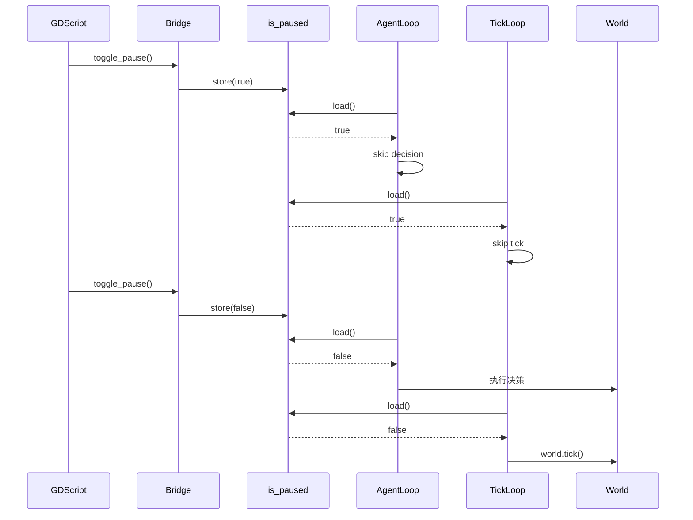

# 详细设计文档

## 1. 背景与现状

### 1.1 技术背景

当前架构采用多 tokio task 并行设计：
- 每个 Agent 有独立的 `run_agent_loop` task，按固定间隔执行决策循环
- 命令处理循环在主线程处理 SimCommand（Pause/Start/InjectPreference 等）
- `world.tick()` 包含世界时间推进、临时偏好衰减、压力事件触发等逻辑

### 1.2 现状分析

```
┌─────────────────────────────────────────────────────────────────────────┐
│ 当前架构：独立 task 无法感知暂停状态                                      │
├─────────────────────────────────────────────────────────────────────────┤
│                                                                         │
│   命令处理循环 (line 947-981)                                            │
│   ├─ is_paused: bool                                                    │
│   ├─ SimCommand::Pause → is_paused = !is_paused                         │
│   └─ if is_paused { sleep; continue }  ← 只影响自身循环                  │
│                                                                         │
│   run_agent_loop (独立 task, 每个 Agent 一个)                            │
│   ├─ loop {                                                             │
│   │     // ❌ 不检查 is_paused                                          │
│   │     interval.tick().await                                           │
│   │     ...决策执行...                                                   │
│   │ }                                                                   │
│                                                                         │
│   run_snapshot_loop (独立 task)                                          │
│   └─ 每 5 秒发送 snapshot，不检查暂停                                    │
│                                                                         │
│   ❌ world.tick() 从未被调用                                             │
│                                                                         │
└─────────────────────────────────────────────────────────────────────────┘
```

核心问题：
1. **暂停不生效**：`is_paused` 是命令循环的局部变量，Agent task 无法访问
2. **世界时间停摆**：没有 tick 循环，`world.tick()` 从未调用
3. **临时偏好可能注入失败**：需要验证 agent_id 匹配

### 1.3 关键干系人

- **SimulationBridge**：Rust 桥接层，管理模拟循环
- **Godot 客户端**：调用 `toggle_pause()` 和 `inject_preference()`
- **World**：核心世界模型，包含 `tick()` 方法

## 2. 设计目标

### 目标

- 暂停时所有 Agent 决策循环停止运行
- 世界时间定期推进（world.tick() 定期调用）
- 暂停恢复后状态正确继续，不丢失数据
- 临时偏好注入正确生效，在 Prompt 中可见

### 非目标

- 不修改 Godot 客户端 UI
- 不修改 World.tick() 内部逻辑
- 不添加新的 SimCommand 类型

## 3. 整体架构

### 3.1 架构概览

```
┌─────────────────────────────────────────────────────────────────────────┐
│ 新架构：共享暂停状态 + 独立 tick 循环                                     │
├─────────────────────────────────────────────────────────────────────────┤
│                                                                         │
│   ┌──────────────────────────────────────────────────────────┐         │
│   │              Arc<AtomicBool> is_paused                    │         │
│   │              （共享暂停状态）                               │         │
│   └─────────────────────┬────────────────────────────────────┘         │
│                         │                                              │
│         ┌───────────────┼───────────────┬───────────────┐             │
│         │               │               │               │             │
│         ▼               ▼               ▼               ▼             │
│   ┌─────────┐    ┌─────────┐    ┌─────────┐    ┌─────────┐           │
│   │命令循环 │    │tick循环 │    │Agent 1 │    │Agent N │           │
│   │         │    │         │    │ loop   │    │ loop   │           │
│   │修改状态 │    │调用     │    │检查状态│    │检查状态│           │
│   │         │    │world.   │    │跳过决策│    │跳过决策│           │
│   │         │    │tick()   │    │暂停时  │    │暂停时  │           │
│   └─────────┘    └─────────┘    └─────────┘    └─────────┘           │
│                                                                         │
└─────────────────────────────────────────────────────────────────────────┘
```

### 3.2 核心组件

| 组件名 | 职责说明 |
| --- | --- |
| `is_paused` (Arc<AtomicBool>) | 共享暂停状态，所有 task 可读取，命令循环可写入 |
| `run_tick_loop` (新增) | 独立 task，定期调用 world.tick()，暂停时跳过 |
| `run_agent_loop` (修改) | 决策前检查 is_paused，暂停时跳过决策 |
| `run_snapshot_loop` (修改) | 暂停时跳过 snapshot 发送 |

### 3.3 数据流设计



## 4. 详细设计

### 4.1 共享暂停状态

使用 `Arc<AtomicBool>` 实现跨 task 暂停状态共享：

```rust
// 在 run_simulation 函数中创建
let is_paused = Arc::new(AtomicBool::new(false));

// 传递给各循环
run_agent_loop(..., is_paused.clone()).await;
run_tick_loop(..., is_paused.clone()).await;
run_snapshot_loop(..., is_paused.clone()).await;
```

### 4.2 新增 tick 循环

```rust
async fn run_tick_loop(
    world: Arc<Mutex<World>>,
    is_paused: Arc<AtomicBool>,
    tick_interval_secs: u32,  // 从配置读取，默认 1 秒
) {
    let mut interval = tokio::time::interval(Duration::from_secs(tick_interval_secs as u64));
    interval.set_missed_tick_behavior(tokio::time::MissedTickBehavior::Skip);
    
    loop {
        interval.tick().await;
        
        if is_paused.load(Ordering::SeqCst) {
            continue;  // 暂停时跳过 tick
        }
        
        let mut w = world.lock().await;
        w.tick();  // 推进世界时间
        tracing::debug!("[TickLoop] world.tick = {}", w.tick);
    }
}
```

### 4.3 修改 Agent 决策循环

在 `run_agent_loop` 中添加暂停检查：

```rust
async fn run_agent_loop(
    world: Arc<Mutex<World>>,
    agent_id: AgentId,
    pipeline: Arc<DecisionPipeline>,
    delta_tx: Sender<AgentDelta>,
    narrative_tx: Sender<NarrativeEvent>,
    is_npc: bool,
    interval_secs: u32,
    vision_radius: u32,
    is_paused: Arc<AtomicBool>,  // 新增参数
) {
    // ... 初始化代码 ...
    
    loop {
        interval.tick().await;
        
        // 暂停检查：跳过决策
        if is_paused.load(Ordering::SeqCst) {
            tracing::trace!("[AgentLoop] Agent {:?} 暂停中，跳过决策", agent_id);
            continue;
        }
        
        // ... 原有决策逻辑 ...
    }
}
```

### 4.4 修改命令处理循环

```rust
// 使用 Arc<AtomicBool> 替代局部变量
let is_paused_arc = Arc::new(AtomicBool::new(false));

loop {
    while let Ok(cmd) = cmd_rx.try_recv() {
        match cmd {
            SimCommand::Pause => {
                let current = is_paused_arc.load(Ordering::SeqCst);
                is_paused_arc.store(!current, Ordering::SeqCst);
                tracing::info!("模拟暂停状态 = {}", !current);
            }
            SimCommand::Start => {
                is_paused_arc.store(false, Ordering::SeqCst);
                tracing::info!("模拟恢复运行");
            }
            // ... 其他命令 ...
        }
    }
    
    // 不再需要 sleep continue，因为 Agent/tick 循环自己会检查
    tokio::time::sleep(Duration::from_millis(100)).await;
}
```

### 4.5 临时偏好注入验证

在 `InjectPreference` 处理中添加验证日志：

```rust
SimCommand::InjectPreference { agent_id, key, boost, duration_ticks } => {
    let aid = AgentId::new(agent_id.clone());
    let mut world = world_arc.lock().await;
    
    // 验证 Agent 存在
    if let Some(agent) = world.agents.get_mut(&aid) {
        agent.inject_preference(&key, boost, duration_ticks);
        tracing::info!(
            "✅ 注入偏好成功: {:?} key={} boost={} duration={} ticks, 当前偏好数={}",
            aid, key, boost, duration_ticks, agent.temp_preferences.len()
        );
        
        // 打印当前偏好状态（用于验证）
        for pref in &agent.temp_preferences {
            tracing::debug!(
                "  偏好: key={} boost={} remaining={}",
                pref.key, pref.boost, pref.remaining_ticks
            );
        }
    } else {
        tracing::warn!(
            "❌ 注入偏好失败: Agent {:?} 不存在，当前 Agent 列表: {:?}",
            aid, world.agents.keys().collect::<Vec<_>>()
        );
    }
}
```

### 4.6 异常处理

| 异常场景 | 处理策略 |
| --- | --- |
| Agent 不存在 | 输出警告日志，列出当前所有 Agent ID |
| world.tick() 调用失败 | 捕获 panic，记录错误，继续循环 |
| 暂停状态竞争 | 使用 SeqCst ordering 保证顺序一致性 |
| 恢复后立即执行 | 第一个 interval.tick() 后检查状态再执行 |

## 5. 技术决策

### 决策1：使用 Arc<AtomicBool> 共享状态

- **选型方案**：`Arc<AtomicBool>` 跨 task 共享布尔值
- **选择理由**：
  - 无锁设计，性能高
  - tokio task 间安全共享
  - AtomicBool 的 Ordering::SeqCst 保证顺序一致性
- **备选方案**：mpsc channel 广播暂停信号
- **放弃原因**：channel 需要每个 task 有独立 receiver，管理复杂

### 决策2：独立 tick 循环

- **选型方案**：新增 `run_tick_loop` 独立 task
- **选择理由**：
  - 与 Agent 决策解耦，tick 频率可独立配置
  - 暂停时只跳过 tick，不影响 Agent task 结构
- **备选方案**：在命令循环中定期调用 world.tick()
- **放弃原因**：命令循环主要处理命令，不应承担世界推进职责

### 决策3：tick 间隔默认 1 秒

- **选型方案**：从 sim.toml 读取 `tick_interval_secs`，默认 1
- **选择理由**：
  - 1 秒 tick 间隔与 Agent 决策间隔（2-5 秒）解耦
  - 资源刷新、压力事件等以 tick 为单位，1 秒/tick 方便计算
- **备选方案**：与 Agent 决策同步 tick
- **放弃原因**：不同 Agent 决策间隔不同，无法同步

## 6. 风险评估

| 飋险点 | 风险等级 | 应对策略 |
| --- | --- | --- |
| AtomicBool 竞争条件 | 低 | 使用 Ordering::SeqCst，保证所有 task 看到相同顺序 |
| tick 循环锁竞争 | 中 | tick 循环与 Agent 决策使用同一 world Arc，需要合理间隔 |
| 暂停恢复后立即执行多个决策 | 低 | interval.tick() 自动 skip missed ticks，恢复后只执行一次 |
| 临时偏好注入时机 | 中 | 注入后立即打印偏好状态，便于验证 |

## 7. 迁移方案

### 7.1 部署步骤

1. 修改 `run_simulation` 创建 `Arc<AtomicBool>` 并传递给各循环
2. 新增 `run_tick_loop` task
3. 修改 `run_agent_loop` 添加暂停检查
4. 修改命令循环使用 `Arc<AtomicBool>`
5. 添加 InjectPreference 验证日志
6. 编译 bridge 并复制到 client/bin/

### 7.2 验证步骤

1. 运行客户端，点击暂停按钮
2. 检查日志：Agent 决策停止，无新的 "开始决策管道执行" 日志
3. 检查日志：world.tick 不推进
4. 点击恢复按钮
5. 检查日志：Agent 决策恢复
6. 检查日志：world.tick 开始推进

### 7.3 回滚方案

若出现问题，可快速回滚：
1. 恢复原有 `run_agent_loop`（移除暂停检查）
2. 移除 `run_tick_loop`
3. 恢复命令循环局部 `is_paused`

## 8. 待定事项

- [ ] 是否需要在 sim.toml 中添加 `tick_interval_secs` 配置项？默认使用 1 秒
- [ ] 是否需要暂停时清空 interval missed ticks？当前使用 Skip 策略自动处理