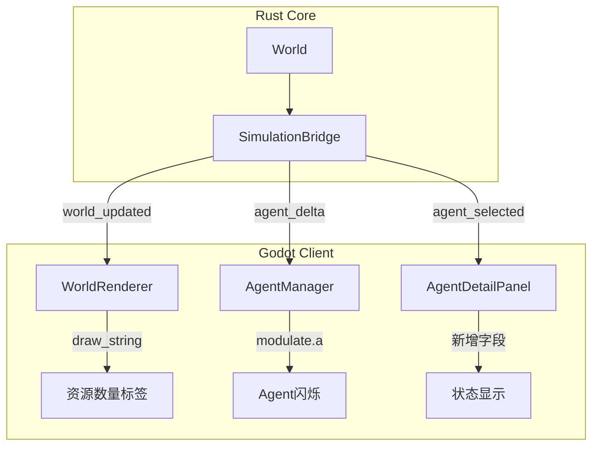
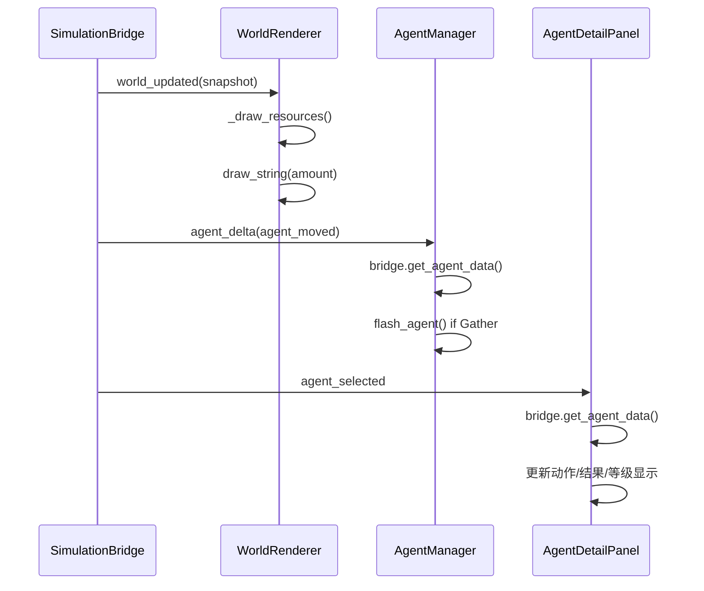

# 详细设计文档

## 1. 背景与现状

### 1.1 技术背景

Agentora 使用 Godot 4 作为客户端引擎，Rust Core 通过 GDExtension Bridge 推送世界状态。当前架构：
- `SimulationBridge` 通过 `agent_delta` 和 `world_updated` 信号推送增量/全量数据
- `world_renderer.gd` 使用 `_draw()` + `queue_redraw()` 绘制地形、资源、建筑
- `agent_manager.gd` 管理 Agent 节点的创建、更新、删除
- `agent_detail_panel.gd` 显示选中 Agent 的状态信息

现有视觉效果实现模式：
- Camp 建筑效果：`sin(_effect_time * 2.0)` 脉动光环（world_renderer.gd 第 293-303 行）
- Agent 选择高亮：换纹理实现（agent_manager.gd 第 216-219 行）

### 1.2 现状分析

当前问题：
- 资源数量仅通过透明度暗示，不直观
- Agent 采集无视觉反馈，玩家不知道 Agent 正在做什么
- AgentDetailPanel 信息不完整，缺少动作、结果、等级

### 1.3 关键干系人

- 纯前端变更，不涉及 Rust Bridge 或 Core
- 无外部系统依赖

## 2. 设计目标

### 目标

- 资源点显示具体数量文本标签
- Agent 采集时产生简单闪烁效果
- AgentDetailPanel 显示动作、结果、等级

### 非目标

- 不实现复杂动画系统（粒子、骨骼动画等）
- 不修改 Rust Bridge delta 推送逻辑
- 不实现交易/战斗连线动画（超出当前范围）

## 3. 整体架构

### 3.1 架构概览



### 3.2 核心组件

| 组件名 | 文件路径 | 职责说明 |
| --- | --- | --- |
| WorldRenderer | client/scripts/world_renderer.gd | 绘制地形、资源、建筑、数量标签 |
| AgentManager | client/scripts/agent_manager.gd | 管理 Agent 节点、闪烁效果 |
| AgentDetailPanel | client/scripts/agent_detail_panel.gd | 显示 Agent 状态信息 |

### 3.3 数据流设计



## 4. 详细设计

### 4.1 前端设计

#### 技术栈

- 框架：Godot 4 GDScript
- 绘制方式：CanvasItem._draw() + queue_redraw()
- 动画方式：sin() 脉动 + _physics_process 更新
- 字体：ThemeDB.fallback_font（无需加载额外资源）

#### 页面设计

| 页面/面板 | 路径 | 说明 |
| --- | --- | --- |
| 世界地图 | Main/WorldView | 显示地形、资源、建筑、数量标签 |
| Agent状态面板 | UI/RightPanel/AgentDetail | 显示HP、饱食、水分、动作、结果、等级 |

#### 组件设计

| 组件名 | 类型 | 文件路径 | 说明 |
| --- | --- | --- | --- |
| 资源数量标签 | CanvasItem绘制 | world_renderer.gd._draw() | draw_string() 绘制数量文本 |
| Agent闪烁效果 | Node属性修改 | agent_manager.gd | sprite.modulate.a 脉动 |
| 动作标签 | Label | agent_detail_panel.gd | 显示 current_action |
| 结果标签 | Label | agent_detail_panel.gd | 显示 action_result |
| 等级标签 | Label | agent_detail_panel.gd | 显示 level |

#### 交互逻辑

**资源数量标签流程**：
1. WorldRenderer._draw_resources() 遍历 _resources 字典
2. 对每个资源点，在绘制纹理后调用 draw_string()
3. 数量文本显示在图标右上角

**Agent闪烁流程**：
1. AgentManager._process_delta() 处理 agent_moved
2. 调用 bridge.get_agent_data() 获取 current_action
3. 若包含 "Gather"，调用 flash_agent(agent_id, Color(0.2, 0.8, 0.2), 0.3)
4. _physics_process() 中用 sin() 更新 modulate.a

**状态面板更新流程**：
1. SimulationBridge 发出 agent_selected 信号
2. AgentDetailPanel._on_agent_selected() 记录 agent_id
3. SimulationBridge 发出 world_updated 信号
4. AgentDetailPanel._update_display() 调用 bridge.get_agent_data()
5. 更新动作、结果、等级标签

#### 前端接口对接

| 接口 | 调用方式 | 调用时机 | 说明 |
| --- | --- | --- | --- |
| bridge.get_agent_data(id) | GDScript func | 状态面板更新 | 获取 Agent 详细数据 |

数据字段映射：
| 字段 | 来源 | 用途 |
| --- | --- | --- |
| current_action | AgentSnapshot | 动作标签 |
| action_result | AgentSnapshot | 结果标签 |
| level | AgentSnapshot | 等级标签 |
| health | AgentSnapshot | HP进度条 |

### 4.2 核心算法

#### 资源数量标签绘制

```gdscript
# world_renderer.gd._draw_resources() 中添加
var _default_font: Font = ThemeDB.fallback_font

# 绘制数量文本（在纹理绘制后）
if amount > 0:
    var label_pos = Vector2(pos_x + _tile_size - 2, pos_y + 2)
    draw_string(_default_font, label_pos, str(amount),
        HORIZONTAL_ALIGNMENT_RIGHT, 20, 10, Color.WHITE)
```

#### Agent闪烁效果

```gdscript
# agent_manager.gd 新增
var _flash_agents: Dictionary = {}  # agent_id -> {"duration": float}
var _effect_time: float = 0.0

func flash_agent(agent_id: String, duration: float = 0.3) -> void:
    _flash_agents[agent_id] = {"duration": duration}

func _physics_process(delta: float) -> void:
    _effect_time += delta
    # 处理 delta 队列...

    # 更新闪烁效果
    for agent_id in _flash_agents.keys():
        var flash_data = _flash_agents[agent_id]
        flash_data["duration"] -= delta
        if flash_data["duration"] <= 0:
            _flash_agents.erase(agent_id)
            if _agent_nodes.has(agent_id):
                var sprite = _agent_nodes[agent_id].get_node_or_null("Sprite")
                if sprite: sprite.modulate.a = 1.0
        else:
            if _agent_nodes.has(agent_id):
                var sprite = _agent_nodes[agent_id].get_node_or_null("Sprite")
                if sprite:
                    sprite.modulate.a = sin(_effect_time * 8.0) * 0.3 + 0.7
```

### 4.3 异常处理

| 异常场景 | 处理策略 |
| --- | --- |
| Agent节点不存在时触发闪烁 | 跳过，不执行闪烁逻辑 |
| 资源数量为0 | 不绘制数量标签，仅跳过 |
| get_agent_data返回空 | 使用默认值填充标签 |

## 5. 技术决策

### 决策1：使用 draw_string() 而非动态 Label 子节点

- **选型方案**：在 _draw() 中直接调用 draw_string() 绘制文本
- **选择理由**：
  - 与现有 Camp 效果绘制方式一致，复用已有模式
  - 无需管理大量动态子节点，性能更优
  - queue_redraw() 自动更新，无需手动同步
- **备选方案**：为每个资源点创建 Label 子节点
- **放弃原因**：需要动态创建/销毁大量节点，管理复杂，影响性能

### 决策2：使用 sin() 脉动而非 Tween 动画

- **选型方案**：`sin(_effect_time * 8.0) * 0.3 + 0.7` 计算透明度
- **选择理由**：
  - 与现有 Camp 脉动光环实现一致
  - 无需创建/管理 Tween 对象，更轻量
  - 可在 _physics_process 中持续更新，代码简洁
- **备选方案**：create_tween() 创建 Tween 动画
- **放弃原因**：Tween 需要手动管理生命周期，对于简单脉动效果过于复杂

### 册策3：使用 ThemeDB.fallback_font 作为默认字体

- **选型方案**：直接使用 ThemeDB.fallback_font
- **选择理由**：无需加载额外字体资源，Godot 内置可用
- **备选方案**：加载自定义字体资源
- **放弃原因**：增加资源管理复杂度，默认字体足够满足需求

## 6. 风险评估

| 风险点 | 风险等级 | 应对策略 |
| --- | --- | --- |
| draw_string 性能影响 | 低 | 仅绘制可见区域，使用 queue_redraw 节流 |
| 闪烁效果视觉疲劳 | 低 | 持续时间短（0.3秒），颜色柔和（绿色） |
| 字体渲染模糊 | 低 | 字号10足够清晰，测试验证 |

## 7. 迁移方案

### 7.1 部署步骤

1. 修改 world_renderer.gd 添加字体加载和数量标签绘制
2. 修改 agent_manager.gd 添加闪烁系统
3. 修改 agent_detail_panel.gd 添加状态显示
4. 运行 Godot 客户端验证效果

### 7.2 回滚方案

删除新增代码即可回滚，无数据迁移。

## 8. 待定事项

- 无待定事项，设计已明确