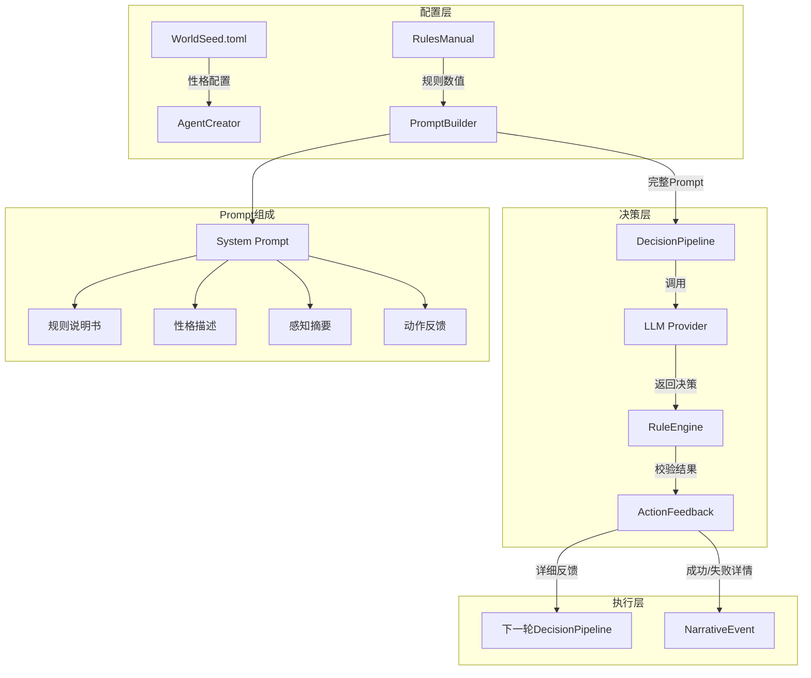
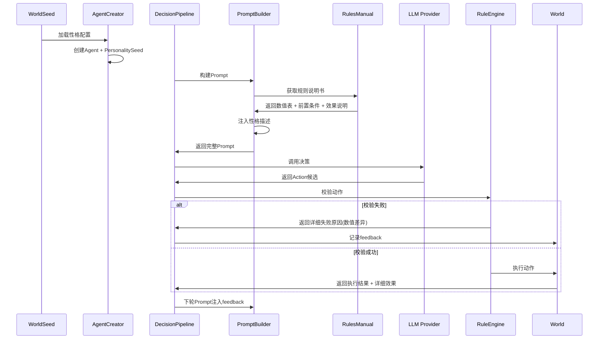

# 详细设计文档

## 1. 背景与现状

### 1.1 技术背景

当前Agent决策系统采用Prompt驱动的LLM决策模式。核心流程：

```
WorldState → PromptBuilder → LLM调用 → 规则校验 → Action执行 → feedback
```

关键组件：
- `prompt.rs`：构建System Prompt + 感知摘要 + 输出格式
- `decision.rs`：决策管道，调用LLM并处理结果
- `rule_engine.rs`：校验动作合法性
- `seed.rs`：WorldSeed加载世界配置
- `types.rs`：PersonalitySeed结构（大五人格三维）

### 1.2 现状分析

**Prompt规则说明缺陷**：
- System Prompt只描述大概机制，缺少具体数值
- 动作前置条件说明不完整（Build消耗未明确列出）
- 建筑效果、压力事件影响未注入Prompt
- LLM决策像"瞎猜"，无法基于明确规则做合理判断

**Agent个性缺失**：
- PersonalitySeed永远使用默认值(0.5, 0.5, 0.5)
- WorldSeed不支持Agent性格配置
- Prompt只说"你是{agent_name}"，无性格描述
- 所有Agent决策风格雷同

**动作反馈不足**：
- `validation_failure`机制存在但信息不详细
- LLM无法从失败中学习具体规则
- 如"Build失败"但没说需要多少资源

### 1.3 关键干系人

- **LLM Provider**：需要接收完整规则的Prompt才能做出合理决策
- **WorldSeed配置**：需要扩展支持Agent性格配置
- **规则引擎**：需要返回详细的校验失败原因

## 2. 设计目标

### 目标

- 补全Prompt中的规则说明书，包含所有数值、前置条件、效果
- 创建Agent个性配置系统，性格描述注入Prompt影响决策倾向
- 强化动作反馈机制，失败时返回具体数值差异和条件检查结果
- 让LLM能够基于明确规则做合理决策，从失败中学习

### 非目标

- 不改变LLM调用机制（max_tokens、temperature保持不变）
- 不新增动作类型或修改动作执行逻辑
- 不实现Agent间性格传播或文化传承（未来增强）
- 不实现动态规则调整（如玩家自定义规则）

## 3. 整体架构

### 3.1 架构概览



### 3.2 核心组件

| 组件名 | 职责说明 |
| --- | --- |
| `RulesManual` | 规则数值表模块，提供完整规则说明书模板 |
| `PromptBuilder` | 扩展：注入规则说明书、性格描述、详细反馈 |
| `WorldSeed` | 扩展：添加Agent性格配置字段 |
| `AgentCreator` | Agent创建时读取性格配置，设置PersonalitySeed |
| `RuleEngine` | 扩展：校验失败时返回详细数值差异 |
| `ActionFeedback` | 动作执行后生成详细反馈信息 |

### 3.3 数据流设计



## 4. 详细设计

### 4.1 规则说明书模块设计

#### RulesManual结构

```rust
// crates/core/src/prompt.rs 新增

/// 规则数值表
pub struct RulesManual {
    /// 生存消耗规则
    survival: SurvivalRules,
    /// 资源恢复规则
    recovery: RecoveryRules,
    /// 采集规则
    gather: GatherRules,
    /// 库存规则
    inventory: InventoryRules,
    /// 建筑规则
    structure: StructureRules,
    /// 压力事件规则
    pressure: PressureRules,
}

pub struct SurvivalRules {
    pub satiety_decay_per_tick: u32,    // 1
    pub hydration_decay_per_tick: u32,  // 1
    pub death_on_hp_zero: bool,         // true
}

pub struct RecoveryRules {
    pub eat_satiety_gain: u32,          // +30
    pub drink_hydration_gain: u32,      // +25
    pub eat_requires_food: u32,         // 1
    pub drink_requires_water: u32,      // 1
}

pub struct GatherRules {
    pub gather_amount: u32,             // 2
    pub depleted_threshold: u32,        // 0
}

pub struct InventoryRules {
    pub default_stack_limit: u32,       // 20
    pub warehouse_stack_limit: u32,     // 40
}

pub struct StructureRules {
    pub camp_cost: HashMap<ResourceType, u32>,  // Wood x5 + Stone x2
    pub fence_cost: HashMap<ResourceType, u32>, // Wood x2
    pub warehouse_cost: HashMap<ResourceType, u32>, // Wood x10 + Stone x5
    pub camp_heal_per_tick: u32,        // 2
    pub camp_range: u32,                // 曼哈顿距离≤1
}

pub struct PressureRules {
    pub drought_water_reduction: f32,   // 0.5 (50%)
    pub abundance_food_multiplier: f32, // 2.0
    pub plague_hp_loss: u32,            // 20
    pub trigger_interval: (u32, u32),   // (40, 80)
}
```

#### 规则说明书注入Prompt

```rust
// PromptBuilder 扩展方法

fn build_rules_section(&self, world_state: &WorldState) -> String {
    let manual = RulesManual::default();
    let mut section = String::new();
    
    // 核心规则（始终注入）
    section.push_str("【世界规则数值表】\n");
    section.push_str(&format!(
        "- 饱食度每tick下降{}，水分度每tick下降{}\n",
        manual.survival.satiety_decay_per_tick,
        manual.survival.hydration_decay_per_tick
    ));
    section.push_str(&format!(
        "- Eat：消耗{}food，饱食度+{}（不超过100）\n",
        manual.recovery.eat_requires_food,
        manual.recovery.eat_satiety_gain
    ));
    // ... 其他核心规则
    
    // 扩展规则（按需注入）
    if world_state.agent_satiety <= 50 {
        section.push_str("【生存紧迫提示】饱食度偏低，建议优先进食恢复\n");
    }
    
    if world_state.nearby_structures.iter().any(|s| s.structure_type == StructureType::Camp) {
        section.push_str(&format!(
            "【建筑效果】Camp：范围内每tick恢复{}HP\n",
            manual.structure.camp_heal_per_tick
        ));
    }
    
    if !world_state.active_pressures.is_empty() {
        section.push_str("【压力事件】");
        for p in &world_state.active_pressures {
            section.push_str(&format!("{} ", p));
        }
        section.push_str("\n");
    }
    
    section
}
```

### 4.2 Agent个性配置设计

#### WorldSeed扩展

```toml
# worldseeds/default.toml 新增配置段

[agent_personalities]
# 性格模板定义
templates = {
    explorer = { openness = 0.8, agreeableness = 0.3, neuroticism = 0.4, description = "一个好奇的探索者，喜欢发现新事物，倾向于独自行动" },
    socializer = { openness = 0.6, agreeableness = 0.8, neuroticism = 0.3, description = "一个友善的交际者，喜欢与其他Agent交流，乐于合作" },
    survivor = { openness = 0.3, agreeableness = 0.4, neuroticism = 0.7, description = "一个谨慎的生存者，注重自身安全，会优先储备资源" },
    builder = { openness = 0.5, agreeableness = 0.6, neuroticism = 0.3, description = "一个创造者，喜欢建造建筑和留下遗产" },
}

# Agent创建时的性格分配方式
assignment = "random"  # 可选：random, default, explorer, socializer, survivor, builder

# 默认性格（未配置或assignment=default时使用）
default = { openness = 0.5, agreeableness = 0.5, neuroticism = 0.5, description = "一个普通的世界居民" }
```

#### PersonalitySeed扩展

```rust
// crates/core/src/types.rs

#[derive(Debug, Clone, Serialize, Deserialize)]
pub struct PersonalitySeed {
    pub openness: f32,       // 开放性 [0.0, 1.0]
    pub agreeableness: f32,  // 宜人性 [0.0, 1.0]
    pub neuroticism: f32,    // 神经质 [0.0, 1.0]
    /// 性格描述文本，注入Prompt影响决策倾向
    pub description: String,
}

impl PersonalitySeed {
    /// 从性格模板创建
    pub fn from_template(template: &PersonalityTemplate) -> Self {
        Self {
            openness: template.openness,
            agreeableness: template.agreeableness,
            neuroticism: template.neuroticism,
            description: template.description.clone(),
        }
    }
}

/// 性格模板配置
#[derive(Debug, Clone, Serialize, Deserialize)]
pub struct PersonalityTemplate {
    pub openness: f32,
    pub agreeableness: f32,
    pub neuroticism: f32,
    pub description: String,
}
```

#### 性格注入Prompt

```rust
// PromptBuilder 扩展

fn build_personality_section(&self, agent_name: &str, personality: &PersonalitySeed) -> String {
    if personality.description.is_empty() {
        format!("你是 {}，一个自主决策的 AI Agent。\n", agent_name)
    } else {
        format!("你是 {}，{}。\n", agent_name, personality.description)
    }
}
```

### 4.3 详细动作反馈设计

#### ActionFeedback结构

```rust
// crates/core/src/world/actions.rs 新增

/// 动作执行反馈
pub struct ActionFeedback {
    /// 动作类型
    pub action_type: String,
    /// 执行结果
    pub result: ActionResult,
    /// 详细信息（数值变化、资源差异等）
    pub details: String,
}

pub enum ActionResult {
    Success,
    Failed,
}

impl ActionFeedback {
    /// 生成失败反馈（资源不足）
    pub fn build_failed_resource(action: &str, required: &HashMap<ResourceType, u32>, available: &HashMap<String, u32>) -> Self {
        let mut details = format!("{}失败：资源不足。需要", action);
        let req_items: Vec<String> = required.iter()
            .map(|(r, n)| format!("{} x{}", r.as_str(), n))
            .collect();
        details.push_str(&req_items.join(" + "));
        details.push_str(", 背包中只有");
        let avail_items: Vec<String> = available.iter()
            .map(|(r, n)| format!("{} x{}", r, n))
            .collect();
        details.push_str(&avail_items.join(" + "));
        
        Self {
            action_type: action.to_string(),
            result: ActionResult::Failed,
            details,
        }
    }
    
    /// 生成成功反馈（采集）
    pub fn gather_success(resource: ResourceType, amount: u32, remaining: u32, inventory_count: u32) -> Self {
        Self {
            action_type: "Gather".to_string(),
            result: ActionResult::Success,
            details: format!(
                "Gather成功：获得{} x{}。当前位置{}资源剩余x{}。背包{}增至x{}",
                resource.as_str(), amount, resource.as_str(), remaining, resource.as_str(), inventory_count
            ),
        }
    }
    
    /// 生成成功反馈（进食）
    pub fn eat_success(satiety_before: u32, satiety_after: u32, food_remaining: u32) -> Self {
        Self {
            action_type: "Eat".to_string(),
            result: ActionResult::Success,
            details: format!(
                "Eat成功：消耗food x1，饱食度+{}（从{}增至{}）。背包food剩余x{}",
                satiety_after - satiety_before, satiety_before, satiety_after, food_remaining
            ),
        }
    }
}
```

#### 规则引擎返回详细失败原因

```rust
// crates/core/src/rule_engine.rs 扩展

pub fn validate_action(&self, candidate: &ActionCandidate, world_state: &WorldState) -> (bool, Option<String>) {
    match &candidate.action_type {
        ActionType::Build { structure } => {
            let cost = structure.resource_cost();
            for (resource, required) in &cost {
                let available = world_state.agent_inventory.get(resource).copied().unwrap_or(0);
                if available < *required {
                    // 返回详细的资源差异
                    let cost_str: Vec<String> = cost.iter()
                        .map(|(r, n)| format!("{} x{}", r.as_str(), n))
                        .collect();
                    let inv_str: Vec<String> = world_state.agent_inventory.iter()
                        .map(|(r, n)| format!("{} x{}", r.as_str(), n))
                        .collect();
                    return (false, Some(format!(
                        "Build失败：资源不足。需要{}，背包只有{}",
                        cost_str.join(" + "), inv_str.join(" + ")
                    )));
                }
            }
            (true, None)
        }
        
        ActionType::Eat => {
            let food = world_state.agent_inventory.get(&ResourceType::Food).copied().unwrap_or(0);
            if food == 0 {
                // 返回详细的食物缺失信息
                let inv_str: Vec<String> = world_state.agent_inventory.iter()
                    .map(|(r, n)| format!("{} x{}", r.as_str(), n))
                    .collect();
                return (false, Some(format!(
                    "Eat失败：背包中没有food。当前背包：{}", 
                    if inv_str.is_empty() { "空" } else { &inv_str.join(", ") }
                )));
            }
            (true, None)
        }
        
        ActionType::Gather { resource } => {
            // 检查当前位置是否有该资源
            let pos = world_state.agent_position;
            let has_resource = world_state.resources_at.get(&pos)
                .map(|(r, _)| r == resource)
                .unwrap_or(false);
            if !has_resource {
                return (false, Some(format!(
                    "Gather失败：当前位置({},{})没有{}资源。请先MoveToward到资源位置",
                    pos.x, pos.y, resource.as_str()
                )));
            }
            // 检查资源是否耗尽
            let amount = world_state.resources_at.get(&pos)
                .map(|(_, a)| a)
                .unwrap_or(0);
            if amount == 0 {
                return (false, Some(format!(
                    "Gather失败：当前位置{}资源已耗尽。请寻找其他资源节点",
                    resource.as_str()
                )));
            }
            (true, None)
        }
        
        // ... 其他动作校验
        _ => (true, None),
    }
}
```

### 4.4 异常处理

| 异常场景 | 处理策略 |
| --- | --- |
| 性格配置缺失 | 使用硬编码默认性格(openness=0.5, description="") |
| 规则说明书token超限 | 优先保留核心规则，截断扩展规则描述 |
| 动作反馈过长 | 截断至200字符，保留关键数值信息 |
| 性格模板名称无效 | 回退到default模板 |

## 5. 技术决策

### 决策1：规则数值来源

- **选型方案**：RulesManual硬编码默认值，未来可从配置文件加载
- **选择理由**：当前规则相对固定，硬编码简化实现；预留扩展接口
- **备选方案**：从config/rules.toml动态加载
- **放弃原因**：增加配置复杂度，当前阶段收益不明显

### 决策2：性格配置位置

- **选型方案**：在WorldSeed（worldseeds/*.toml）中配置
- **选择理由**：与世界其他配置（地形比例、资源密度）统一管理
- **备选方案**：单独的personality.toml配置文件
- **放弃原因**：配置分散增加维护成本

### 册策3：反馈信息格式

- **选型方案**：统一格式"{动作}成功/失败：{具体原因}。{补充说明}"
- **选择理由**：便于LLM理解和处理，格式一致降低解析复杂度
- **备选方案**：结构化JSON格式反馈
- **放弃原因**：增加Prompt复杂度，文本格式足够表达

## 6. 风险评估

| 风险点 | 风险等级 | 应对策略 |
| --- | --- | --- |
| Prompt token超限 | 中 | 规则说明书分层注入，核心规则优先，扩展规则按需 |
| 规则数值与实现不一致 | 高 | RulesManual数值与代码实际值同步，定期校验 |
| 性格描述对决策影响不可控 | 低 | description只是提示，LLM仍自主决策；可调整描述措辞 |
| 反馈信息过长影响Prompt | 低 | 截断反馈信息，保留关键数值 |

## 7. 迁移方案

### 7.1 部署步骤

1. 修改WorldSeed添加`[agent_personalities]`配置段
2. 扩展PersonalitySeed结构添加description字段
3. 修改Agent创建逻辑读取性格配置
4. 扩展PromptBuilder注入规则说明书和性格描述
5. 修改规则引擎返回详细失败原因
6. 扩展动作执行生成详细反馈信息

### 7.2 灰度策略

- 先在测试环境验证LLM决策质量提升
- 对比错误率（动作失败次数/总动作数）
- 确认效果后合并到主分支

### 7.3 回滚方案

- 若Prompt token问题严重，可临时禁用扩展规则注入
- 若性格配置导致决策异常，可设置assignment="default"
- 规则数值不一致时，立即修复RulesManual数值

## 8. 待定事项

- [ ] 性格描述措辞优化（确保暗示正确倾向但不强制）
- [ ] 规则说明书token预算测试（实际消耗量）
- [ ] 动作反馈最大长度限制（200字符是否合适）