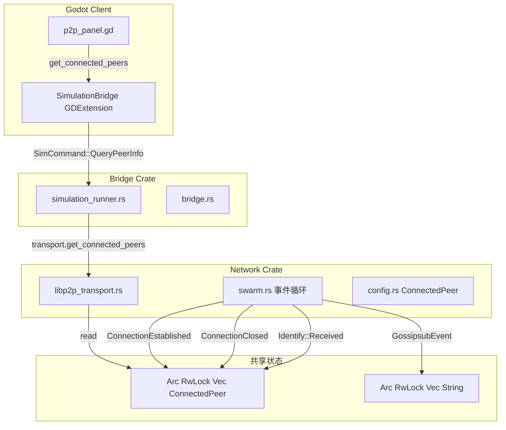
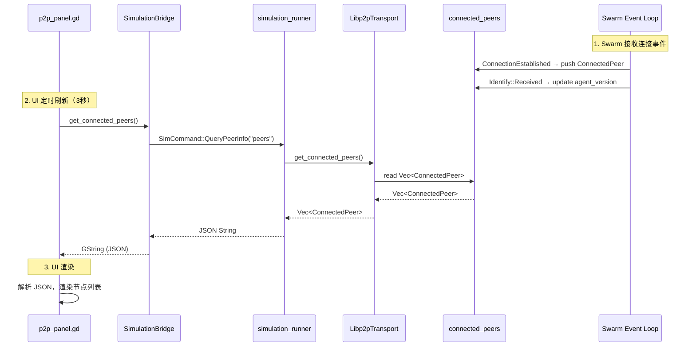

# 详细设计文档

## 1. 背景与现状

### 1.1 技术背景

Agentora 使用 libp2p 构建 P2P 网络层，包括：
- **Swarm**：核心事件循环，处理连接、GossipSub、KAD DHT、Relay、DCUtR、AutoNAT、Identify 等协议
- **GossipSub**：消息广播，用于区域订阅和 Delta/Narrative 同步
- **Libp2pTransport**：对外暴露的传输层 API，封装 Swarm 操作
- **SimulationBridge**：GDExtension 桥接节点，通过 mpsc 通道与 Rust 后端通信

关键约束：
- Rust 后端运行在独立 OS thread 的 tokio runtime 中
- Swarm 事件处理在异步 task 中
- 共享状态使用 `Arc<RwLock<>>` 跨线程共享
- Godot UI 通过 `SimulationBridge` 的 GDExtension API 查询状态

### 1.2 现状分析

当前问题：
1. **ConnectionEstablished 事件丢失**：`swarm.rs:265-269` 只打印日志，没有存储到共享状态
2. **查询返回错误数据**：`simulation_runner.rs:195-207` 的 `"peers"` 查询返回 `relay_reservations`（中继预留），而非真正的连接节点
3. **缺少节点类型判断**：没有通过 Identify 协议的 `agent_version` 区分玩家节点 vs 中继服务器
4. **缺少订阅状态跟踪**：GossipSub 的订阅/退订事件没有存储

### 1.3 关键干系人

- **Network Crate**：负责 Swarm 事件处理和 Libp2pTransport API
- **Bridge Crate**：负责暴露 GDExtension API 给 Godot
- **Godot Client**：负责 UI 渲染和用户交互

## 2. 设计目标

### 目标

- 在 Swarm 层跟踪 ConnectionEstablished/ConnectionClosed 事件，存储到共享状态
- 新增 `ConnectedPeer` 结构体记录连接详细信息
- 新增 `get_connected_peers()` 和 `get_subscribed_topics()` API
- 更新 UI 显示真正的已连接节点列表和订阅状态

### 非目标

- 不改变连接流程（直连/中继/打洞逻辑保持不变）
- 不新增公共 Relay Server 支持
- 不修改 KAD DHT 发现逻辑
- 不修改 GossipSub 消息处理逻辑

## 3. 整体架构

### 3.1 架构概览



### 3.2 核心组件

| 组件名 | 职责说明 |
| --- | --- |
| `ConnectedPeer` | 新增结构体，存储单个连接的详细信息 |
| `connected_peers` | 新增共享状态，`Arc<RwLock<Vec<ConnectedPeer>>>` |
| `subscribed_topics` | 新增共享状态，`Arc<RwLock<Vec<String>>>` |
| Swarm 事件处理 | 处理 ConnectionEstablished/Closed/Identify/Subscribe 事件 |
| Libp2pTransport API | 新增 `get_connected_peers()` 和 `get_subscribed_topics()` |
| simulation_runner | 修改 `"peers"` 查询调用新方法 |
| SimulationBridge | 返回值格式保持兼容（JSON 字符串） |
| p2p_panel.gd | UI 显示优化，解析新 JSON 格式 |

### 3.3 数据流设计



## 4. 详细设计

### 4.1 接口设计

#### ConnectedPeer 结构体

```rust
// crates/network/src/config.rs

/// 已连接节点信息
#[derive(Debug, Clone, Serialize)]
pub struct ConnectedPeer {
    /// libp2p PeerId（完整46字符）
    pub peer_id: String,
    /// Identify 协议获取的 agent_version
    pub agent_version: String,
    /// 连接方式（Direct/Relay/Dcutr）
    pub connection_type: ConnectionType,
    /// 连接建立时间（ISO 8601 格式）
    pub connected_at: String,
    /// 是否为中继服务器
    pub is_relay_server: bool,
    /// 对方的监听地址（如果已知）
    pub listen_addr: Option<String>,
}
```

#### Libp2pTransport 新增方法

```rust
// crates/network/src/libp2p_transport.rs

impl Libp2pTransport {
    /// 获取已连接节点列表
    pub async fn get_connected_peers(&self) -> Vec<ConnectedPeer> {
        self.connected_peers.read().await.clone()
    }

    /// 获取订阅的 topic 列表
    pub async fn get_subscribed_topics(&self) -> Vec<String> {
        self.subscribed_topics.read().await.clone()
    }
}
```

#### SimulationBridge API（保持兼容）

```rust
// crates/bridge/src/bridge.rs

#[func]
fn get_connected_peers(&self) -> GString {
    // 返回 JSON 字符串，格式变更：
    // [{"peer_id": "...", "agent_version": "...", "connection_type": "...", ...}]
}
```

### 4.2 数据模型

#### run_swarm_event_loop 参数变更

```rust
// crates/network/src/swarm.rs

pub async fn run_swarm_event_loop(
    local_key: identity::Keypair,
    peer_id: PeerId,
    listen_port: u16,
    mut command_rx: mpsc::Receiver<SwarmCommand>,
    message_tx: mpsc::Sender<NetworkMessage>,
    relay_reservations: Arc<RwLock<Vec<RelayReservation>>>,
    nat_status: Arc<RwLock<NatStatus>>,
    direct_connections: Arc<RwLock<HashSet<String>>>,
    // 新增参数
    connected_peers: Arc<RwLock<Vec<ConnectedPeer>>>,
    subscribed_topics: Arc<RwLock<Vec<String>>>,
    topic_handlers: Arc<RwLock<HashMap<String, Box<dyn MessageHandler>>>>,
)
```

### 4.3 核心算法

#### ConnectionEstablished 事件处理

```rust
// swarm.rs handle_swarm_event

SwarmEvent::ConnectionEstablished { peer_id, endpoint, .. } => {
    tracing::info!("连接到 peer: {} ({:?})", peer_id, endpoint);

    // 创建 ConnectedPeer
    let connected_peer = ConnectedPeer {
        peer_id: peer_id.to_string(),
        agent_version: String::new(), // 待 Identify 协议更新
        connection_type: ConnectionType::Direct, // 默认直连，待后续判断
        connected_at: chrono::Utc::now().to_rfc3339(),
        is_relay_server: false, // 待 Identify 更新
        listen_addr: endpoint.get_remote_address().map(|a| a.to_string()),
    };

    // 写入共享状态
    connected_peers.write().await.push(connected_peer);
}
```

#### ConnectionClosed 事件处理

```rust
SwarmEvent::ConnectionClosed { peer_id, cause, .. } => {
    tracing::info!("与 peer {} 连接关闭：{:?}", peer_id, cause);

    // 从共享状态移除
    let mut peers = connected_peers.write().await;
    peers.retain(|p| p.peer_id != peer_id.to_string());
}
```

#### Identify 协议更新 agent_version

```rust
AgentoraBehaviourEvent::Identify(identify_event) => {
    match identify_event {
        libp2p_identify::Event::Received { peer_id, info, .. } => {
            tracing::info!("Identify 信息：from={}, agent={}", peer_id, info.agent_version);

            // 更新 connected_peers 中的 agent_version
            let mut peers = connected_peers.write().await;
            if let Some(peer) = peers.iter_mut().find(|p| p.peer_id == peer_id.to_string()) {
                peer.agent_version = info.agent_version.clone();
                // 判断是否为中继服务器
                peer.is_relay_server = info.agent_version.contains("relay")
                    || info.agent_version.contains("libp2p-relay");
            }
        }
        _ => {}
    }
}
```

#### 订阅事件跟踪

```rust
GossipsubEvent::Subscribed { peer_id, topic } => {
    tracing::debug!("Peer {} 订阅 topic: {}", peer_id, topic);

    // 如果是本地订阅（peer_id == local_peer_id）
    if peer_id == local_libp2p_peer_id {
        subscribed_topics.write().await.push(topic.to_string());
    }
}

// Subscribe 命令成功时
SwarmCommand::Subscribe { topic } => {
    let topic = gossipsub::IdentTopic::new(&topic);
    if let Err(e) = swarm.behaviour_mut().gossipsub.subscribe(&topic) {
        tracing::error!("订阅失败：{:?}", e);
    } else {
        // 添加到订阅列表
        let topic_name = topic.to_string();
        subscribed_topics.write().await.push(topic_name);
        tracing::info!("订阅成功：{}", topic_name);
    }
}
```

### 4.4 异常处理

| 异常场景 | 处理策略 |
| --- | --- |
| Identify 协议未返回 | agent_version 保持空字符串，is_relay_server 默认 false |
| 查询超时（>1秒） | 返回空列表 `"[]"`，记录警告日志 |
| ConnectionClosed 但 peer 不在列表 | 忽略，不做任何操作 |
| 重复订阅同一 topic | GossipSub 自动处理，列表中不重复添加 |
| JSON 解析失败 | UI 显示 "解析失败"，使用灰色文字提示 |

### 4.5 前端设计

#### 技术栈

- 框架：Godot 4.x GDScript
- UI组件：内置 Control 节点（VBoxContainer, Label, Button）

#### 页面布局

```
P2PPopup (PanelContainer)
├── VBox
│   ├── 本节点信息
│   │   ├── PeerIdLabel: "Peer ID: 12D3KooWGzqHv..."
│   │   ├── PortLabel: "监听端口: 4001"
│   │   └── NatStatusLabel: "NAT: 公网可达 (...)"
│   │
│   ├── HSeparator
│   │
│   ├── 已连接节点标题: "已连接节点 (N):"
│   ├── PeersList (VBoxContainer)
│   │   ├── [动态] PeerItem (VBoxContainer)
│   │   │   ├── PeerIdRow: "12D3KooAB... [玩家]"
│   │   │   ├── AgentRow: "agent: agentora/1.0.0"
│   │   │   ├── ConnRow: "连接方式: 直连 | 时间: 10:23:45"
│   │
│   ├── HSeparator
│   │
│   ├── 订阅标题: "订阅的 Topic:"
│   ├── TopicsList (VBoxContainer)
│   │   ├── [动态] TopicLabel: "✅ world_events"
│   │
│   ├── HSeparator
│   │
│   ├── 操作区域
│   │   ├── SeedAddressInput (LineEdit)
│   │   ├── ConnectButton (Button)
│   │
│   ├── CloseBtn (Button)
```

#### 组件设计

| 组件名 | 类型 | 文件路径 | 说明 |
| --- | --- | --- | --- |
| P2PPopup | PanelContainer | scenes/p2p_panel.tscn | P2P 面板主容器 |
| PeerItem | 动态生成 | p2p_panel.gd | 单个节点信息显示（3行 Label） |
| TopicLabel | 动态生成 | p2p_panel.gd | 单个 topic 显示（带勾选标记） |

#### 交互逻辑

1. **定时刷新**：每 3 秒调用 `_refresh_peer_info()`
   - 调用 `bridge.get_connected_peers()`
   - 调用新增的 `bridge.get_subscribed_topics()`
   - 解析 JSON 并重新渲染列表

2. **手动连接**：点击"连接种子节点"按钮
   - 获取输入框地址
   - 调用 `bridge.connect_to_seed(address)`
   - 显示连接状态反馈

3. **节点类型区分显示**：
   - 玩家节点：`[玩家]` 标签，绿色文字
   - 中继服务器：`[中继]` 标签，黄色文字

#### 前端接口对接

| 接口 | 返回类型 | 调用时机 | 说明 |
| --- | --- | --- | --- |
| `bridge.get_connected_peers()` | GString (JSON) | 定时刷新(3秒) | 返回已连接节点列表 |
| `bridge.get_subscribed_topics()` | GString (JSON) | 定时刷新(3秒) | 返回订阅的 topic 列表 |
| `bridge.get_peer_id()` | GString | 定时刷新 | 返回本地 PeerId |
| `bridge.get_nat_status()` | Dictionary | 定时刷新 | 返回 NAT 状态 |
| `bridge.connect_to_seed(addr)` | bool | 点击按钮 | 连接种子节点 |

## 5. 技术决策

### 决策1：使用 Arc<RwLock<Vec<ConnectedPeer>>>

- **选型方案**：使用 `Arc<tokio::sync::RwLock<Vec<ConnectedPeer>>>` 共享状态
- **选择理由**：
  - 与现有代码风格一致（relay_reservations, nat_status 使用相同模式）
  - 支持异步读写，不阻塞 Swarm 事件循环
  - RwLock 允许并发读，适合 UI 频繁查询场景
- **备选方案**：使用 `Arc<Mutex<Vec<ConnectedPeer>>>`
- **放弃原因**：Mutex 不支持并发读，性能略差

### 决策2：connection_type 默认值策略

- **选型方案**：ConnectionEstablished 时默认 `Direct`，后续通过 DCUtR/Relay 事件更新
- **选择理由**：
  - Identify 协议不提供连接方式信息
  - 需要通过其他事件（DCUtR success, Relay circuit established）更新
- **备选方案**：延迟判断，等待后续事件再填充
- **放弃原因**：会导致 UI 短暂显示不完整信息

## 6. 风险评估

| 风险点 | 风险等级 | 应对策略 |
| --- | --- | --- |
| Identify 协议延迟 | 低 | agent_version 先显示空，后续更新 |
| JSON 格式变更兼容 | 中 | UI 增加解析失败处理，显示提示 |
| 连接方式判断不准确 | 中 | 默认 Direct，后续事件更新；UI 显示可能有短暂不一致 |
| 线程安全 | 低 | 使用 Arc<RwLock>，与现有模式一致 |

## 7. 迁移方案

### 7.1 部署步骤

1. 编译 bridge crate：`cargo build -p agentora-bridge`
2. 复制产物到 client/bin/
3. 启动 Godot 客户端验证

### 7.2 灰度策略

无需灰度，纯客户端功能变更。

### 7.3 回滚方案

1. 恢复 simulation_runner.rs 中 `"peers"` 查询为 `relay_reservations`
2. 重新编译 bridge
3. UI 回退显示 relay_reservations（或保持兼容解析）

## 8. 待定事项

- [ ] 确认是否需要新增 `bridge.get_subscribed_topics()` GDExtension API
- [ ] 确认 connection_type 更新时机（DCUtR success 事件是否能准确判断）
- [ ] 确认 topic 订阅是否需要区分"本地订阅"vs"远程 peer 订阅"