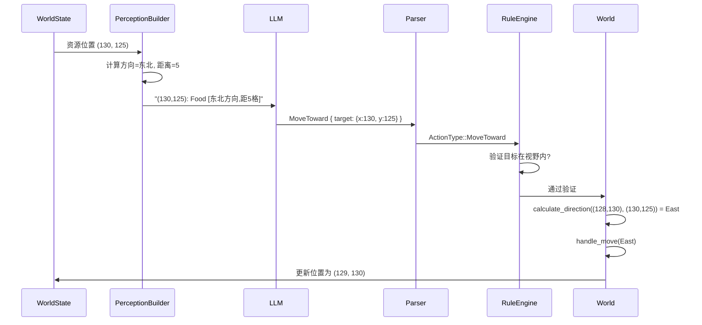

# 详细设计文档

## 1. 背景与现状

### 1.1 技术背景

Agentora 采用 Rust 核心 + Godot 前端的架构，决策管道使用 LLM 生成动作。当前 ActionType 枚举只支持四个方向（东南西北）的 Move 动作，无法直接指定目标坐标。

关键约束：
- 动作系统基于 `ActionType` 枚举，新增动作需要修改多个模块
- 感知摘要由 `DecisionPipeline.build_perception_summary()` 构建
- 规则引擎负责硬约束过滤和动作验证
- LLM 响应通过 `parse_action_type()` 解析

### 1.2 现状分析

**当前问题：**

```
Agent 位置: (128, 130)
资源 Food 在: (130, 125)

LLM 看到的感知：
  资源分布:
    (130, 125): Food x100

LLM 必须计算：
  dx = 130 - 128 = 2 (东)
  dy = 125 - 130 = -5 (北)
  方向 = 东北？还是东？

LLM 输出：
  { "action_type": "Move", "params": { "direction": "East" } }  ← 可能选错方向
```

**问题影响：**
- 小模型（Qwen-2B）容易计算错误
- 浪费 token 在数学计算上
- 限制 Agent 的自主决策能力
- 与项目"LLM 驱动自主演化"的核心目标相悖

### 1.3 关键干系人

| 干系人 | 角色 |
| --- | --- |
| LLM Agent | 动作发起者，需要直观的导航能力 |
| DecisionPipeline | 感知构建者和动作解析者 |
| RuleEngine | 动作验证者 |
| World | 动作执行者 |
| Godot Bridge | 数据序列化传输 |

## 2. 设计目标

### 目标

1. LLM 可以直接输出 `MoveToward { target: (x, y) }` 格式的动作
2. 感知摘要显示资源的相对方向和曼哈顿距离
3. Agent 无需计算方向即可导航到目标资源
4. 向后兼容原有的 `Move { direction }` 动作

### 非目标

- 不涉及路径规划算法（A* 算法等）
- 不支持多点导航（一次只能移动一格）
- 不修改 Godot 客户端 UI

## 3. 整体架构

### 3.1 架构概览

```
┌─────────────────────────────────────────────────────────────────┐
│                        DecisionPipeline                          │
│  ┌─────────────────────┐    ┌─────────────────────────────────┐ │
│  │ build_perception_   │    │ parse_action_type()            │ │
│  │ summary()           │    │                                 │ │
│  │                     │    │  "MoveToward" → ActionType::    │ │
│  │ 原始: (130,125):Food│    │  MoveToward { target: Position }│ │
│  │ 增强: (130,125):Food│    │                                 │ │
│  │      [东北方向,距5格]│    │  支持: MoveToward/move_toward/  │ │
│  └──────────┬──────────┘    │         移动到/前往             │ │
│             │               └───────────────┬─────────────────┘ │
│             ▼                               ▼                   │
│  ┌─────────────────────────────────────────────────────────────┐│
│  │                    LLM Provider                              ││
│  │  输入: 增强感知摘要                                          ││
│  │  输出: MoveToward { target: { x: 130, y: 125 } }            ││
│  └─────────────────────────────────────────────────────────────┘│
└─────────────────────────────────────────────────────────────────┘
                              │
                              ▼
┌─────────────────────────────────────────────────────────────────┐
│                        RuleEngine                                │
│  ┌─────────────────────────────────────────────────────────────┐│
│  │ filter_hard_constraints()                                   ││
│  │                                                             ││
│  │ 验证 MoveToward:                                            ││
│  │  - target 在地图有效范围内                                   ││
│  │  - target 在视野范围内 (radius=5)                           ││
│  │  - target 地形可通行                                        ││
│  └─────────────────────────────────────────────────────────────┘│
└─────────────────────────────────────────────────────────────────┘
                              │
                              ▼
┌─────────────────────────────────────────────────────────────────┐
│                           World                                  │
│  ┌─────────────────────────────────────────────────────────────┐│
│  │ apply_action()                                              ││
│  │   match ActionType::MoveToward { target } =>                ││
│  │     handle_move_toward(target)                              ││
│  │                                                             ││
│  │ handle_move_toward(target):                                 ││
│  │   direction = calculate_direction(current_pos, target)     ││
│  │   handle_move(direction) // 复用现有移动逻辑                 ││
│  └─────────────────────────────────────────────────────────────┘│
└─────────────────────────────────────────────────────────────────┘
```

### 3.2 核心组件

| 组件名 | 所属模块 | 职责说明 |
| --- | --- | --- |
| ActionType | types.rs | 新增 MoveToward 枚举变体 |
| Position | types.rs | 坐标类型，已存在，复用 |
| build_perception_summary | decision.rs | 增强资源显示，添加方向和距离 |
| parse_action_type | decision.rs | 解析 MoveToward JSON |
| filter_hard_constraints | rule_engine.rs | 验证 MoveToward 目标有效性 |
| handle_move_toward | world/actions.rs | 执行单步移动 |
| calculate_direction | world/actions.rs 或 vision.rs | 计算方向辅助函数 |

### 3.3 数据流设计



## 4. 详细设计

### 4.1 接口设计

#### ActionType 枚举扩展

```rust
// crates/core/src/types.rs

pub enum ActionType {
    Move { direction: Direction },
    MoveToward { target: Position },  // 新增
    Gather { resource: ResourceType },
    // ... 其他动作
}
```

#### Direction 计算函数

```rust
// crates/core/src/vision.rs 或 world/actions.rs

/// 计算从源位置到目标位置的主要移动方向
pub fn calculate_direction(from: &Position, to: &Position) -> Option<Direction> {
    let dx = to.x as i32 - from.x as i32;
    let dy = to.y as i32 - from.y as i32;

    if dx == 0 && dy == 0 {
        return None; // 已在目标位置
    }

    // 东西方向优先（取绝对值较大的）
    if dx.abs() >= dy.abs() {
        if dx > 0 { Some(Direction::East) } else { Some(Direction::West) }
    } else {
        if dy > 0 { Some(Direction::South) } else { Some(Direction::North) }
    }
}

/// 计算方向的中文描述（用于感知摘要）
pub fn direction_description(from: &Position, to: &Position) -> String {
    let dx = to.x as i32 - from.x as i32;
    let dy = to.y as i32 - from.y as i32;
    let distance = dx.abs() + dy.abs();

    let direction = match (dx.cmp(&0), dy.cmp(&0)) {
        (std::cmp::Ordering::Greater, std::cmp::Ordering::Less) => "东北",
        (std::cmp::Ordering::Greater, std::cmp::Ordering::Greater) => "东南",
        (std::cmp::Ordering::Greater, std::cmp::Ordering::Equal) => "东",
        (std::cmp::Ordering::Less, std::cmp::Ordering::Less) => "西北",
        (std::cmp::Ordering::Less, std::cmp::Ordering::Greater) => "西南",
        (std::cmp::Ordering::Less, std::cmp::Ordering::Equal) => "西",
        (std::cmp::Ordering::Equal, std::cmp::Ordering::Greater) => "南",
        (std::cmp::Ordering::Equal, std::cmp::Ordering::Less) => "北",
        (std::cmp::Ordering::Equal, std::cmp::Ordering::Equal) => "原地",
    };

    format!("{}方向，距{}格", direction, distance)
}
```

### 4.2 感知摘要增强设计

```rust
// crates/core/src/decision.rs

fn build_perception_summary(&self, world_state: &WorldState) -> String {
    // ... 现有代码 ...

    // 资源信息增强
    if !world_state.resources_at.is_empty() {
        summary.push_str("资源分布:\n");

        // 按生存优先级排序
        let mut resources: Vec<_> = world_state.resources_at.iter().collect();
        resources.sort_by(|a, b| {
            let priority = |r: &ResourceType| match r {
                ResourceType::Food => 0,
                ResourceType::Water => 1,
                ResourceType::Wood => 2,
                ResourceType::Stone => 3,
                ResourceType::Iron => 4,
            };
            priority(&a.1.0).cmp(&priority(&b.1.0))
        });

        for (pos, (resource, amount)) in resources {
            let dir_desc = direction_description(&world_state.agent_position, pos);
            let abundance = if *amount >= 100 { "(大量)" }
                           else if *amount >= 50 { "(中等)" }
                           else { "(少量)" };
            summary.push_str(&format!(
                "  ({}, {}): {:?} x{} {} [{}]\n",
                pos.x, pos.y, resource, amount, abundance, dir_desc
            ));
        }
    }

    summary
}
```

### 4.3 LLM 响应解析设计

```rust
// crates/core/src/decision.rs

fn parse_action_type(&self, type_str: &str, json: &serde_json::Value) -> Option<ActionType> {
    match type_str {
        // 现有动作...

        // 新增: MoveToward 动作解析
        "MoveToward" | "move_toward" | "移动到" | "前往" => {
            let target = self.parse_target_position(json)?;
            Some(ActionType::MoveToward { target })
        }

        // ...
    }
}

fn parse_target_position(&self, json: &serde_json::Value) -> Option<Position> {
    // 尝试多种格式解析目标位置
    let target = json.get("params")?.get("target")?;

    // 格式1: { x: 130, y: 125 }
    if let (Some(x), Some(y)) = (target.get("x"), target.get("y")) {
        return Some(Position::new(
            x.as_u64()? as u32,
            y.as_u64()? as u32
        ));
    }

    // 格式2: [130, 125]
    if let Some(arr) = target.as_array() {
        if arr.len() >= 2 {
            return Some(Position::new(
                arr[0].as_u64()? as u32,
                arr[1].as_u64()? as u32
            ));
        }
    }

    // 格式3: "130,125" 或 "(130, 125)"
    if let Some(s) = target.as_str() {
        let cleaned = s.trim_matches(|c| c == '(' || c == ')');
        let parts: Vec<&str> = cleaned.split(',').collect();
        if parts.len() >= 2 {
            return Some(Position::new(
                parts[0].trim().parse().ok()?,
                parts[1].trim().parse().ok()?
            ));
        }
    }

    None
}
```

### 4.4 规则引擎验证设计

```rust
// crates/core/src/rule_engine.rs

impl RuleEngine {
    /// 硬约束过滤：增加 MoveToward 验证
    pub fn filter_hard_constraints(&self, world_state: &WorldState) -> Vec<ActionType> {
        let mut candidates = Vec::new();

        // 现有候选动作...

        // 新增: MoveToward 验证
        // 如果视野内有资源，生成指向最近资源的 MoveToward
        if !world_state.resources_at.is_empty() {
            for (pos, (_, amount)) in &world_state.resources_at {
                // 验证目标有效
                if self.is_valid_move_toward_target(pos, world_state) {
                    candidates.push(ActionType::MoveToward { target: *pos });
                }
            }
            // 只保留最近3个资源的 MoveToward，避免候选过多
            candidates = self.limit_move_toward_candidates(candidates, world_state);
        }

        candidates
    }

    fn is_valid_move_toward_target(&self, target: &Position, world_state: &WorldState) -> bool {
        // 验证1: 目标在地图有效范围内
        if target.x >= world_state.map_size || target.y >= world_state.map_size {
            return false;
        }

        // 验证2: 目标在视野范围内（曼哈顿距离 <= 5）
        let dx = (target.x as i32 - world_state.agent_position.x as i32).abs();
        let dy = (target.y as i32 - world_state.agent_position.y as i32).abs();
        if dx + dy > 5 {
            return false;
        }

        // 验证3: 目标地形可通行（可选，可以允许不可通行目标，移动时会被阻挡）
        if let Some(terrain) = world_state.terrain_at.get(target) {
            if !terrain.is_passable() {
                return false;
            }
        }

        true
    }

    /// 验证 LLM 返回的 MoveToward 动作
    pub fn validate_move_toward(&self, target: &Position, world_state: &WorldState) -> bool {
        self.is_valid_move_toward_target(target, world_state)
    }
}
```

### 4.5 动作执行设计

```rust
// crates/core/src/world/actions.rs

impl World {
    /// 处理 MoveToward 动作
    pub fn handle_move_toward(&mut self, agent_id: &AgentId, target: Position) -> ActionResult {
        let agent = match self.agents.get(agent_id) {
            Some(a) => a,
            None => return ActionResult::InvalidAgent,
        };

        // 如果已在目标位置，无操作
        if agent.position == target {
            return ActionResult::Success;
        }

        // 计算方向
        let direction = match calculate_direction(&agent.position, &target) {
            Some(d) => d,
            None => return ActionResult::Success, // 已在目标位置
        };

        // 复用现有移动逻辑
        self.handle_move(agent_id, direction)
    }
}

// 在 apply_action 中添加分发
impl World {
    pub fn apply_action(&mut self, agent_id: &AgentId, action: &ActionType) -> ActionResult {
        match action {
            ActionType::Move { direction } => self.handle_move(agent_id, *direction),
            ActionType::MoveToward { target } => self.handle_move_toward(agent_id, *target), // 新增
            // ... 其他动作
        }
    }
}
```

### 4.6 异常处理

| 异常场景 | 处理策略 |
| --- | --- |
| 目标坐标为负数 | 验证失败，返回 ActionResult::OutOfBounds |
| 目标超出地图边界 | 验证失败，返回 ActionResult::OutOfBounds |
| 目标超出视野范围 | 验证失败，候选动作不包含此动作 |
| 目标地形不可通行 | 验证失败，候选动作不包含此动作 |
| LLM 返回无效坐标格式 | 解析失败时使用 Agent 当前位置作为默认值 |
| 目标即当前位置 | 返回 ActionResult::Success，无操作 |
| 移动路径被阻挡 | 返回 ActionResult::Blocked，Agent 位置不变 |

## 5. 技术决策

### 决策1：MoveToward 只执行单步移动

- **选型方案**：MoveToward 每次只移动一格，不自动寻路到目标
- **选择理由**：
  1. 与现有 Move 动作行为一致
  2. 保持决策的细粒度控制
  3. 避免引入复杂的路径规划逻辑
  4. Agent 每次决策重新评估，更符合智能体理念
- **备选方案**：MoveToward 自动寻路移动到目标
- **放弃原因**：需要引入 A* 算法，增加复杂度，可能错过中间资源

### 决策2：视野范围为曼哈顿距离 5

- **选型方案**：MoveToward 目标必须在曼哈顿距离 ≤ 5 范围内
- **选择理由**：
  1. 与现有 scan_vision 的半径一致
  2. 平衡 LLM 的信息量和决策复杂度
  3. 避免无效的长距离移动指令
- **备选方案**：允许任意距离的 MoveToward
- **放弃原因**：超出视野的目标可能导致无效移动

### 决策3：感知摘要显示精确方向文字

- **选型方案**：显示"东北方向，距5格"格式
- **选择理由**：
  1. 符合中文表达习惯
  2. 易于 LLM 理解
  3. 不增加过多 token
- **备选方案**：显示精确角度或向量
- **放弃原因**：对 LLM 理解没有帮助，增加 token 消耗

## 6. 风险评估

| 风险点 | 风险等级 | 应对策略 |
| --- | --- | --- |
| LLM 仍返回 Move direction 格式 | 低 | 向后兼容，两种动作都支持 |
| 坐标解析失败 | 中 | 多格式解析 + 合理默认值 |
| 候选动作过多 | 低 | 限制最多 3 个 MoveToward 候选 |
| 方向计算错误 | 低 | 单元测试覆盖所有方向组合 |
| 小模型不理解方向提示 | 中 | 在 Prompt 中添加示例 |

## 7. 迁移方案

### 7.1 部署步骤

1. 修改 `types.rs`，新增 `ActionType::MoveToward` 变体
2. 在 `vision.rs` 添加方向计算函数
3. 修改 `decision.rs`，增强感知摘要和解析逻辑
4. 修改 `rule_engine.rs`，添加 MoveToward 验证
5. 修改 `world/actions.rs`，添加 handle_move_toward
6. 修改 `bridge/src/lib.rs`，序列化 MoveToward 动作
7. 运行单元测试和集成测试

### 7.2 回滚方案

如果出现问题：
1. ActionType 新增变体不影响现有枚举值
2. 可通过配置开关禁用 MoveToward 候选生成
3. 感知摘要增强是纯展示，不影响逻辑

## 8. 待定事项

- [ ] 是否需要在 Godot 客户端显示 Agent 的目标位置
- [ ] 是否需要支持 MoveToward 的路径可视化
- [ ] 是否需要考虑其他 Agent 的阻挡情况