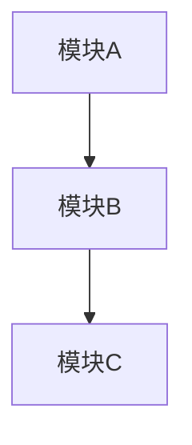
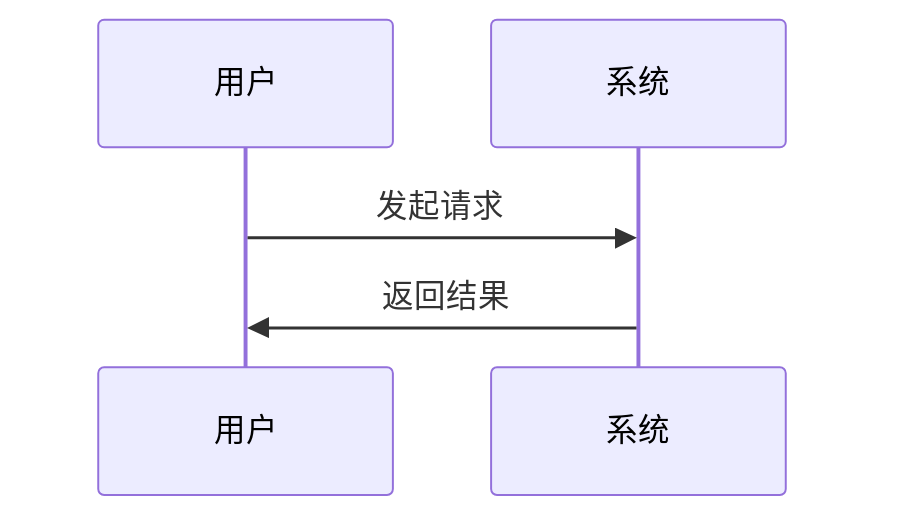

# 详细设计文档

## 1. 背景与现状

### 1.1 技术背景

<!-- 描述相关的技术背景、现有架构、约束条件 -->

### 1.2 现状分析

<!-- 当前系统的现状，存在的问题或限制 -->

### 1.3 关键干系人

<!-- 涉及的团队、角色或外部系统 -->

## 2. 设计目标

### 目标

<!-- 本次设计要达成的目标 -->

- 目标1
- 目标2

### 非目标

<!-- 明确排除在本次设计范围之外的内容 -->

- 非目标1

## 3. 整体架构

### 3.1 架构概览

<!-- 系统架构图或模块关系图，可使用 Mermaid 图表或文字描述 -->



### 3.2 核心组件

<!-- 涉及的主要组件及其职责 -->

| 组件名 | 职责说明 |
| --- | --- |
| 组件A | 职责描述 |

### 3.3 数据流设计

<!-- 关键数据的流转过程，可使用时序图或流程图 -->



## 4. 详细设计

### 4.1 接口设计

<!-- 新增或修改的 API 接口定义 -->

#### 接口：<接口名称>

- **请求方式**：GET/POST/PUT/DELETE
- **请求路径**：`/api/v1/example`
- **请求参数**：

| 参数名 | 类型 | 必填 | 说明 |
| --- | --- | --- | --- |
| param1 | string | 是 | 参数说明 |

- **响应结构**：

```json
{
  "code": 0,
  "message": "success",
  "data": {}
}
```

### 4.2 外部接口调用

<!-- 调用的外部系统API接口（如有） -->

#### 外部接口：<接口名称>

- **所属系统**：外部系统名称
- **请求方式**：GET/POST
- **接口地址**：`/external/api/path`
- **调用位置**：代码中的调用位置
- **请求参数**：

| 参数名 | 类型 | 必填 | 说明 |
| --- | --- | --- | --- |
| param1 | string | 是 | 参数说明 |

- **响应结构**：

```json
{
  "result": {}
}
```

### 4.3 数据模型

<!-- 新增或修改的数据表结构、字段说明（如有） -->

#### 数据表：<表名>

| 字段名 | 类型 | 必填 | 说明 |
| --- | --- | --- | --- |
| id | bigint | 是 | 主键ID |

### 4.4 SQL逻辑

<!-- 业务涉及的关键SQL语句（如有） -->

#### 查询：<功能描述>

```sql
SELECT
    field1,
    field2
FROM table_name
WHERE condition = 'value'
```

**说明**：SQL逻辑的业务含义和过滤条件说明

### 4.5 核心算法

<!-- 关键算法或业务逻辑的伪代码/流程图 -->

```
// 伪代码或流程描述
```

### 4.6 异常处理

<!-- 边界情况和异常场景的处理策略 -->

| 异常场景 | 处理策略 |
| --- | --- |
| 场景1 | 处理方式 |

## 5. 技术决策

<!-- 关键技术选型及理由，包含备选方案对比 -->

### 决策1：<决策标题>

- **选型方案**：
- **选择理由**：
- **备选方案**：
- **放弃原因**：

## 6. 风险评估

| 风险点 | 风险等级 | 应对策略 |
| --- | --- | --- |
| 风险1 | 高/中/低 | 应对措施 |

## 7. 迁移方案

<!-- 部署步骤、灰度策略、回滚方案 -->

### 7.1 部署步骤

1. 步骤1
2. 步骤2

### 7.2 灰度策略

<!-- 灰度发布计划 -->

### 7.3 回滚方案

<!-- 出现问题时的回滚步骤 -->

## 8. 待定事项

<!-- 尚未明确的技术决策或待确认的问题 -->

- [ ] 待定事项1
- [ ] 待定事项2